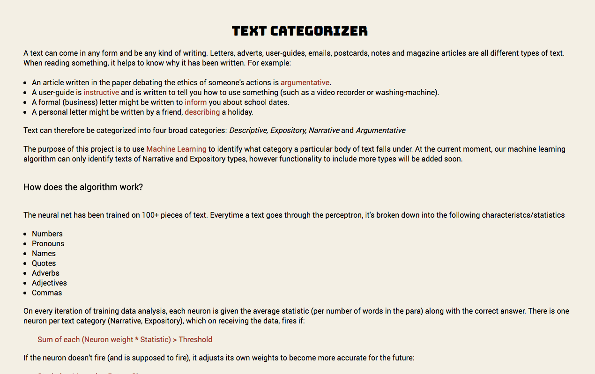
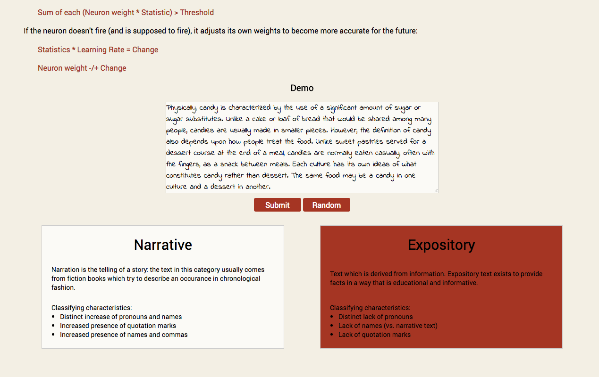

# Text-Categorizer

[Live Site][heroku]
[heroku]: https://text-categorizer.herokuapp.com/

Created by

[Shaurya Sinha][shaurya] and [Victor Aw][victor]
[shaurya]: https://github.com/shaurya157
[victor]: https://github.com/VictorAw

Text Categorizer is a machine learning algorithm capable of categorizing text between two categories - Narrative and Expository. Functionality to add further categories to be added soon.

Users will be able to either choose random text in the demo or input their own text. The random text is testing data that has not been included while training the neural net.

## Functionality and MVP

The neural net will be able to:
- [x] Be trained using training data
- [x] \(Mostly) Accurately identify whether a text is descriptive or narrative after being trained
- [x] Be accessed through an API endpoint
- [x] Be accessed through a Javascript frontend

## Training Data

The neural net will be trained on wikipedia excerpts and novel excerpts. Currently there is 100 training data from a range of articles and books however more data will be added soon.

## Results

- Identifies test data with 75% accuracy

## Technologies and Technical Challenges

- Ruby on Rails backend
- Javascript/HTML frontend
- JQuery
- Algorithmia API to access Stanford Core NLP through HTML requests
- Standford Core NLP to identify parts of speech

Challenges of the project include:

- Deciding how to reduce a text excerpt into inputs for the neural net
- Extracting the information required from the text into the inputs for the neural net
- Writing the learning algorithm for the neural net to be as accurate as possible

## Implementation Details

### Weight Categories

- Numbers
- Pronouns
- Names
- Quotation marks
- Adverbs
- Adjectives
- Commas

### Expected More to Appear In

**Expository**

- Numbers
- Commas

**Narrative**

- Pronouns
- Names
- Quotation marks
- Adverbs
- Adjectives

### Value Calculations

Values will be computed by the number of occurrences of the category in the excerpt divided by the total number of words in the excerpt.

## Future Directions

- [ ] Add in the other two categories, Descriptive and Argumentative
